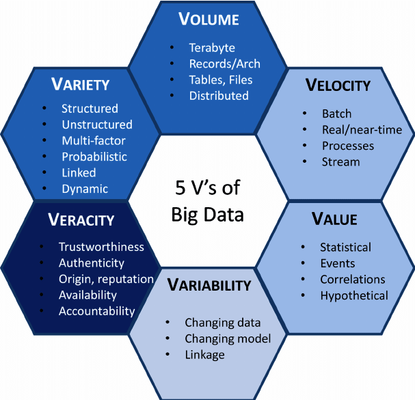
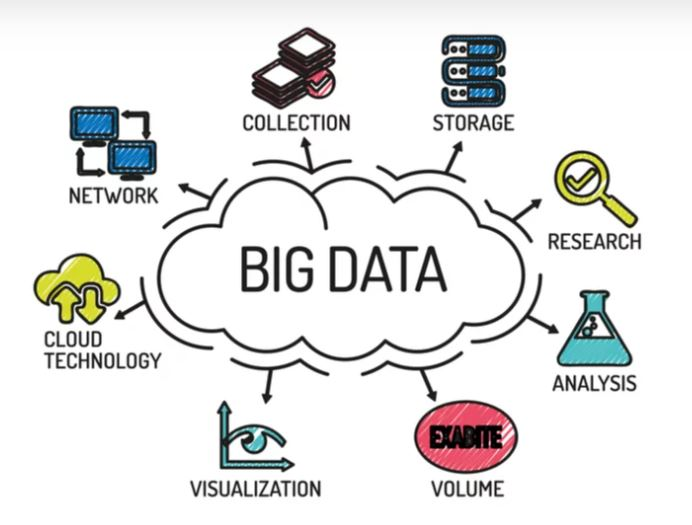
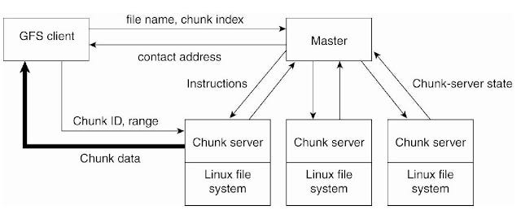
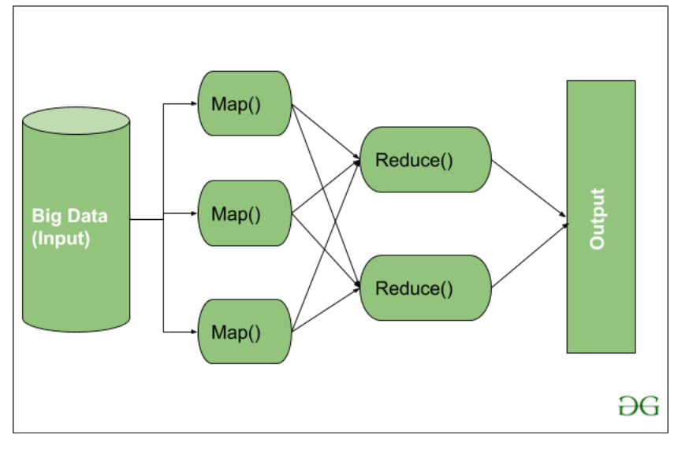
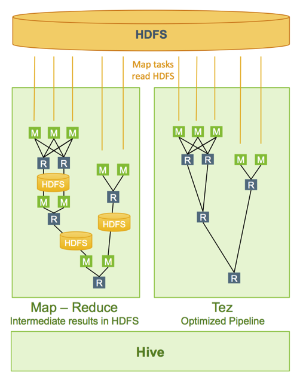
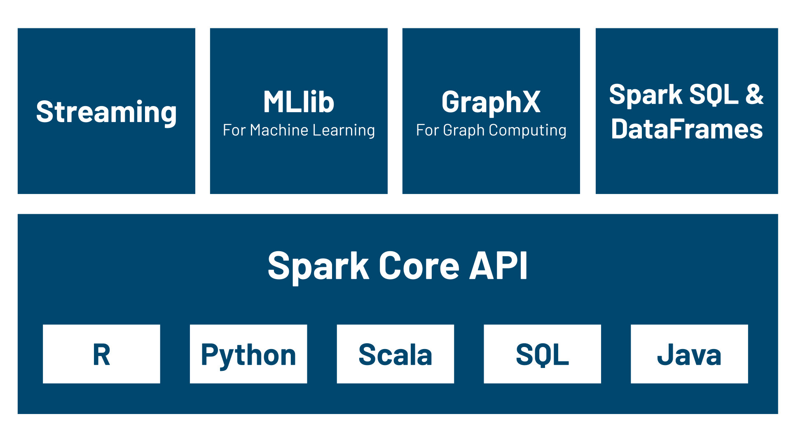
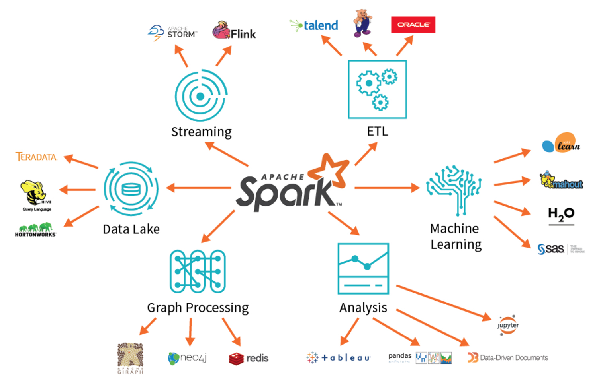
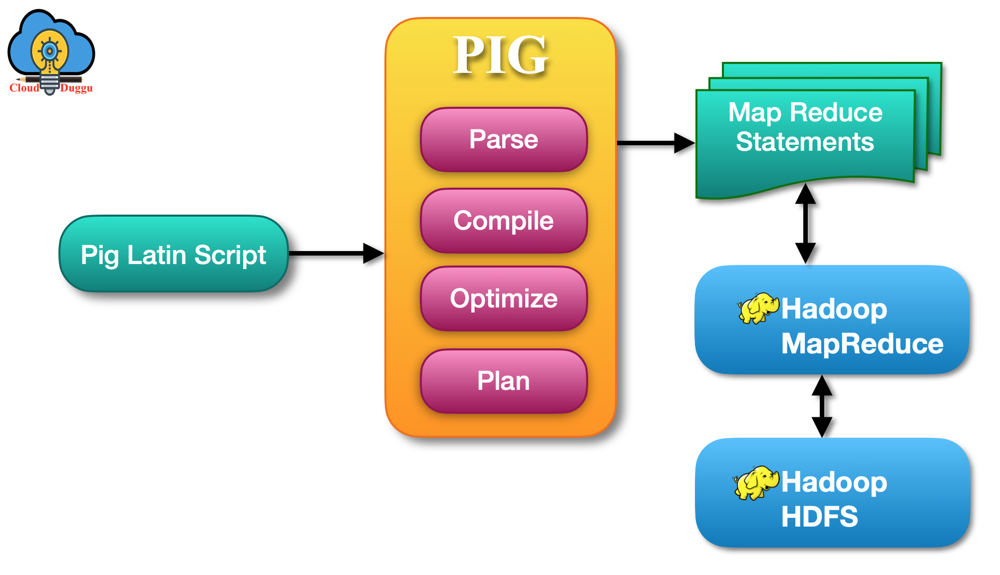

## All About Big Data : Hadoop

### 1. What are 5 V's of data?
 
The 5 V's of Big Data are a set of characteristics that describe the challenges and dimensions of big data. 
The 5 V's are:

* **Volume:** 
Refers to the sheer size of the data being generated and collected. 
Big data involves datasets that are too large to be comfortably processed by traditional database systems. 
It often involves terabytes, petabytes, or even larger quantities of data.

* **Velocity:**
Describes the speed at which data is being generated, collected, and processed. 
With the proliferation of real-time systems, IoT devices, and social media, data can be generated at an unprecedented speed. 
This requires the ability to process and analyze data streams in near real-time.

* **Variety:** 
Represents the diverse types of data that are being generated. 
Data comes in many formats, including structured data (like databases), unstructured data (like text or images), 
and semi-structured data (like JSON or XML). 
Big data systems need to be able to handle this variety efficiently.

* **Variability:** 
Refers to the inconsistency in the data's format, quality, and meaning. 
Data sources might have different structures, missing values, or inaccuracies. 
Big data systems must be able to handle and process such variability effectively.

* **Veracity:** 
Relates to the trustworthiness and reliability of the data. 
With the large volume of data being generated from multiple sources, ensuring data quality and accuracy becomes a significant challenge. 
It's important to have mechanisms in place to validate and ensure the correctness of the data.

Some of the other important V's include: 

* **Value:** 
Highlighting the importance of deriving meaningful insights and value from the data. 
Collecting and processing data is valuable only if it leads to actionable insights and informed decision-making.

* **Validity:** 
Emphasizing the necessity of ensuring that the data is valid, accurate, and trustworthy.

* **Volatility:** 
Referring to the temporary nature of certain data streams or the rapid changes in data over time.

-------------------------------------------------

### 2. What is big data?
Big data refers to extremely large and complex datasets that cannot be easily managed, processed, or analyzed using traditional data processing tools and methods. These datasets are characterized by their volume, variety, velocity, and sometimes veracity.

The concept of big data has gained prominence due to advancements in technology, such as increased storage capacities, faster processing capabilities, and improved data analytics techniques. Organizations and researchers use big data analytics to extract valuable insights, trends, patterns, and correlations from these massive datasets. These insights can help with making informed decisions, improving business strategies, enhancing scientific research, and more.

To process and analyze big data effectively, specialized tools and technologies have emerged, such as distributed computing frameworks (like Hadoop), NoSQL databases, data lakes, and machine learning algorithms. These tools enable organizations to handle the challenges posed by the enormous amounts of data generated in today's digital world.

-------------------------------------------------

### 3. What is Apache Hadoop? Also mention its versions.
Apache Hadoop is an open-source framework designed for storing and processing large datasets in a distributed computing environment. It was created to address the challenges of handling big data, which involves massive volumes of data that cannot be easily managed or processed using traditional methods.

The core components of Apache Hadoop include:
* **Hadoop Distributed File System (HDFS):**
HDFS is a distributed file system that allows large datasets to be stored across multiple servers (nodes) in a cluster. It divides files into smaller blocks and replicates them across different nodes for fault tolerance. This architecture enables efficient data storage and retrieval.

* **MapReduce:**
MapReduce is a programming model and processing engine that allows developers to write programs for processing and analyzing large datasets in parallel across a distributed cluster. It simplifies the process of breaking down complex tasks into smaller tasks that can be executed concurrently.

* **YARN (Yet Another Resource Negotiator)**
YARN is a resource management and job scheduling component in Hadoop. It manages and allocates resources to different applications running on the cluster, enabling efficient utilization of cluster resources.

* **Hadoop Common:**
This includes libraries, utilities, and APIs used by various Hadoop modules. It provides a consistent and shared infrastructure for Hadoop components.

* **Hadoop Ecosystem**
Apart from the core components, the Hadoop ecosystem consists of various complementary projects and tools that extend the capabilities of Hadoop. These include tools for data ingestion (Apache Flume, Apache Kafka), data processing (Apache Pig, Apache Hive), data querying (Apache Drill, Apache Impala), and more.

Following are the versions introduced by Apache Hadoop:

* **Hadoop 1.x (2006-2012):**
  The initial release of Hadoop focused on introducing the Hadoop Distributed File System (HDFS) and the MapReduce programming model. It provided a scalable way to process and store large datasets across clusters of commodity hardware.

* **Hadoop 2.x (2012-2013):**
  Hadoop 2 marked a significant shift with the introduction of YARN (Yet Another Resource Negotiator). YARN separated resource management from job scheduling, allowing for more diverse processing frameworks beyond MapReduce. This enabled Hadoop to support a wider range of applications.

* **Hadoop 3.x (2017-present):**
  Hadoop 3 brought further improvements to resource management and added support for erasure coding in HDFS, reducing storage overhead. It also introduced improvements to support larger clusters, more efficient data processing, and enhanced security features.

 
-------------------------------------------------

### 4. What is GFS - Google File System?
The Google File System (GFS) is a proprietary distributed file system developed by Google to manage and store large amounts of data across clusters of commodity hardware. It was designed to meet Google's specific needs for handling vast amounts of data efficiently and reliably, and it served as a foundation for many of Google's services, including Google Search, Google Maps, and Gmail.

Key characteristics of the Google File System include:

* **Scalability:** GFS is designed to scale to accommodate enormous amounts of data. It achieves this by distributing data across multiple storage servers in a cluster, enabling the system to handle petabytes of data across thousands of machines.

* **Fault Tolerance:** GFS is built to operate on commodity hardware, which is prone to failures. It addresses this challenge through data replication. Files are divided into fixed-size chunks, and each chunk is replicated across multiple machines. If one machine fails, the system can retrieve the data from another replica.

* **Simplified Interface:** GFS provides a simplified file system interface, optimized for large files and streaming reads and writes. It sacrifices certain features found in traditional file systems to achieve greater performance and efficiency for Google's workloads.

* **Data Locality:** GFS is designed to take advantage of data locality, meaning that data is stored close to the computation that needs it. This reduces network congestion and speeds up data processing.

* **Master-Chunkserver Architecture:** GFS architecture includes a single master server that manages metadata (such as file namespaces, access control, and location information) and multiple chunk servers responsible for storing and serving data chunks.

It's important to note that GFS is not open source and is proprietary to Google. However, its design principles and concepts have influenced the development of various open-source distributed file systems and storage solutions, including the Hadoop Distributed File System (HDFS) and other similar systems.

### Comparison of GFS / HDFS
The Google File System (GFS) and Hadoop Distributed File System (HDFS) are both distributed file systems designed to manage and store large datasets across clusters of commodity hardware. They share many similarities in terms of goals and design principles, but they were developed by different organizations and serve as foundations for different ecosystems.

Here's a comparison between GFS and HDFS:

* Origin and Purpose:
  
   GFS: Developed by Google for its internal use, GFS was designed to handle Google's massive data storage and processing needs for services like Google Search and Gmail.

  HDFS: HDFS is an open-source project that is part of the Apache Hadoop ecosystem. It was created to provide similar capabilities as GFS and is used for storing and processing big data in a distributed manner.

* Architecture:
  
   Both GFS and HDFS use a master-chunkserver architecture, where there's a master server responsible for metadata management and multiple chunk servers responsible for storing data blocks/chunks.

* Scalability:
  
   Both systems are designed to handle the massive scale required by modern data processing. They achieve scalability by distributing data across a large number of commodity hardware nodes.

* Fault Tolerance:
  
   Both systems address hardware failures and ensure data availability through data replication. Data chunks are replicated across multiple nodes to provide fault tolerance.

* Data Locality:
  
   Both GFS and HDFS are designed to optimize data locality. Data is stored near the computation that needs it, reducing network traffic and improving performance.

* Open Source:
  
  GFS: Google's GFS is a proprietary system and is not publicly available.
  
  HDFS: HDFS is open source and part of the Apache Hadoop project, making it accessible to a wide community of users and developers.

* Ecosystem:
  
   GFS: GFS served as the inspiration for the development of various distributed file systems, including HDFS.

  HDFS: HDFS is a fundamental component of the Apache Hadoop ecosystem, which includes a wide range of tools and frameworks for data storage, processing, and analysis, such as MapReduce, YARN, and various data processing libraries.

In summary, the Google File System (GFS) and Hadoop Distributed File System (HDFS) are similar in their goals of providing scalable and fault-tolerant storage for large datasets. While GFS was developed by Google for its internal use, HDFS emerged as an open-source project within the Apache Hadoop ecosystem and has become a central component in the big data landscape.

-------------------------------------------------

### 5. What is YARN in hadoop context?
YARN stands for "Yet Another Resource Negotiator," is a key component in the Apache Hadoop ecosystem. It was introduced in Hadoop 2.x to address limitations in the original Hadoop MapReduce framework's resource management and job scheduling capabilities. YARN essentially separates the resource management and job scheduling aspects, enabling Hadoop to support a broader range of processing frameworks beyond just MapReduce.

In the context of Hadoop, YARN serves as a resource management layer that efficiently allocates and manages resources across a cluster, enabling different applications to run concurrently and share cluster resources effectively. 

Here's how YARN works within the Hadoop ecosystem:

* **Resource Management:** YARN manages the physical resources (CPU, memory, etc.) of the cluster's nodes. It keeps track of available resources and allocates them to applications as needed. This enables multi-tenancy, allowing various applications to coexist on the same cluster without negatively impacting each other.

* **Application Management:** YARN allows multiple applications to run on the same cluster simultaneously. Each application runs within its own application master, which is responsible for managing its tasks, monitoring progress, and negotiating resource requirements.

* **Job Scheduling:** YARN's ResourceManager handles the allocation of resources based on the resource requirements of applications. It makes scheduling decisions based on fairness and capacity, ensuring optimal resource utilization across the cluster.

* **NodeManager:** Each node in the cluster runs a NodeManager process, responsible for monitoring resource usage on the node and reporting this information to the ResourceManager. It also manages the execution of tasks requested by the ApplicationMaster.

With YARN, Hadoop clusters became more versatile and efficient. In addition to running MapReduce jobs, Hadoop 2.x and later versions can host various other processing frameworks that can share resources in a more flexible manner. This enables a wide range of applications, including real-time data processing (like Apache Spark and Apache Flink), interactive querying (like Apache Tez), and more, to be seamlessly integrated into the Hadoop ecosystem.

-------------------------------------------------

### 6. What is MapReduce ? Solve an example also.

MapReduce is a programming model and processing paradigm designed for processing and generating large-scale datasets across distributed computing clusters. It was popularized by Google and became a fundamental concept in the Hadoop ecosystem. The idea behind MapReduce is to break down a complex data processing task into smaller subtasks that can be executed in parallel across multiple nodes in a cluster.

The MapReduce model consists of two main phases: the "Map" phase and the "Reduce" phase.

* **Map Phase:**
 In this phase, the input data is divided into chunks, and each chunk is processed independently by a "Map" function. The "Map" function takes the input data, applies a transformation to it, and emits key-value pairs as intermediate output.

* **Shuffle and Sort:**
 After the "Map" phase, the intermediate key-value pairs are shuffled and sorted based on their keys. This step groups together all intermediate values associated with the same key, preparing the data for the next phase.

* **Reduce Phase:**
 In the "Reduce" phase, the shuffled and sorted intermediate key-value pairs are processed by the "Reduce" function. The "Reduce" function takes a key and a list of values associated with that key, applies some computation to those values, and generates final output data.

**Example:**

Problem: *Calculate the average score of students from a dataset containing student names and their corresponding scores.*

**Map Phase:**

Input: 
    
    ("Alice", 85), ("Bob", 92), ("Alice", 78), ("Bob", 90), ("Charlie", 75)

Map Function:

    Map("Alice", 85) -> ("Alice", 85)
    
    Map("Bob", 92) -> ("Bob", 92)
    
    Map("Alice", 78) -> ("Alice", 78)
    
    Map("Bob", 90) -> ("Bob", 90)
    
    Map("Charlie", 75) -> ("Charlie", 75)

Shuffle and Sort:

Intermediate Key-Value Pairs: 

    ("Alice", [85, 78]), ("Bob", [92, 90]), ("Charlie", [75])

**Reduce Phase:**

Reduce Function:
 
    Reduce("Alice", [85, 78]) -> ("Alice", 81.5)
    
    Reduce("Bob", [92, 90]) -> ("Bob", 91.0)
    
    Reduce("Charlie", [75]) -> ("Charlie", 75.0)

**Output:**

    "Alice" has an average score of 81.5.
    
    "Bob" has an average score of 91.0.
    
    "Charlie" has an average score of 75.0.

In this example, the MapReduce paradigm effectively calculates the average score for each student by distributing the data processing across multiple nodes and aggregating the results.
   

-------------------------------------------------

### 7. What is Apache Tez?
Apache Tez is an open-source framework built on top of Apache Hadoop YARN (Yet Another Resource Negotiator). Tez aims to improve the efficiency and performance of data processing tasks in the Hadoop ecosystem by providing a more flexible and optimized execution engine. It enables faster and more interactive processing of big data workloads by optimizing the execution of complex directed acyclic graph (DAG) workflows.

Tez addresses some limitations of the original MapReduce model, such as its reliance on a two-phase execution model (Map and Reduce) and its lack of support for complex data processing tasks. Tez introduces a more generalized execution framework that allows users to express arbitrary data processing logic as directed acyclic graphs. This enables complex workflows involving multiple stages and different types of operations to be executed more efficiently.

Key features of Apache Tez include:

* **DAG Execution:** Tez enables the execution of complex data processing workflows represented as directed acyclic graphs (DAGs). These DAGs can include multiple stages of computation, data transformations, joins, aggregations, and more.

* **Efficient Data Movement:** Tez optimizes data movement between tasks, minimizing the amount of data shuffled across the cluster. This reduces the overall processing time and improves performance.

* **Task-level Optimization:** Tez supports task-level optimization, allowing tasks to be dynamically optimized based on data characteristics and execution history. This helps in reducing execution time and resource consumption.

* **User-Defined Functions:** Tez supports custom user-defined functions, enabling developers to express their specific processing logic within DAG workflows.
  
* **Broad Ecosystem Integration:** Tez is designed to work with a variety of data processing frameworks. It can be used as an execution engine for Hive (a data warehousing and SQL-like querying tool), Pig (a data flow language for data processing), and other compatible tools.

* **Compatibility with YARN:** Tez is built on top of YARN, making it compatible with Hadoop clusters and allowing it to leverage YARN's resource management capabilities.

* **Efficient Resource Utilization:** Tez optimizes the utilization of cluster resources by reducing data movement and enabling better sharing of resources among tasks.

-------------------------------------------------

### 8. What is Apache Spark?
Apache Spark is an open-source, distributed computing framework designed for processing and analyzing large-scale data sets. It's a part of the broader big data ecosystem, often used in conjunction with Hadoop, but it can also work independently of Hadoop's HDFS (Hadoop Distributed File System). Apache Spark aims to provide a more efficient and flexible alternative to the traditional MapReduce processing model used in Hadoop.

Key features of Apache Spark:

* **In-Memory Processing:** Spark performs much of its data processing in memory, reducing the need to read and write intermediate results to disk. This leads to significant performance improvements compared to Hadoop's MapReduce, which involves more disk I/O.

* **Ease of Use:** Spark offers APIs in several programming languages (Scala, Java, Python, and R), making it more accessible for developers with different skill sets. This enables more complex data processing tasks without needing to write extensive low-level code.

* **Resilient Distributed Datasets (RDDs):** RDD is the fundamental data structure in Spark. It's an immutable distributed collection of objects that can be processed in parallel. RDDs provide fault tolerance through lineage information, enabling lost data to be reconstructed in case of node failures.

* **Data Transformation and Analysis:** Spark provides a rich set of operators for data transformation and analysis, such as map, reduce, filter, join, and more. These operators allow developers to express complex data processing pipelines more intuitively.

* **Spark SQL:** Spark includes a module for processing structured and semi-structured data using SQL queries. This makes it easier for analysts and data scientists familiar with SQL to work with big data.

* **Machine Learning and Graph Processing:** Spark's MLlib library offers machine learning algorithms that can work with large datasets. Additionally, GraphX provides a graph processing library for graph-based data analysis.

* **Streaming:** Spark Streaming allows real-time processing of data streams. This is useful for applications like monitoring social media, processing log files, or real-time analytics.

* **Cluster Manager Integration:** Spark can be integrated with various cluster managers, such as Apache Hadoop YARN, Apache Mesos, or it can be run in standalone mode.

While Spark can be used independently, it's often employed alongside Hadoop, where HDFS is used as a storage layer for the data and Spark is used for more efficient and faster data processing. This combination leverages the strengths of both frameworks, utilizing Spark's in-memory processing and Hadoop's distributed storage capabilities.

Overall, Apache Spark is a powerful tool in the big data landscape, enabling organizations to process and analyze vast amounts of data more efficiently and with more flexibility than traditional approaches like MapReduce.

-------------------------------------------------

### 9. Compare MapReduce / Tez / Spark
Here is the comparison of MapReduce, Tez, and Spark in terms of their features, performance, and use cases within the context of big data processing:

* **1. Programming Model:**

  MapReduce: MapReduce follows a two-phase processing model, where data is processed in map and reduce phases, requiring explicit definition of map and reduce functions.

  Tez: Tez improves upon MapReduce by introducing a more flexible and optimized execution framework, allowing for more complex data processing DAGs (Directed Acyclic Graphs) beyond the strict map and reduce phases.

  Spark: Spark provides a more versatile programming model with Resilient Distributed Datasets (RDDs) and DataFrames, enabling high-level transformations and actions that can be optimized and executed more efficiently.

* **2. Performance:**

  MapReduce: MapReduce processes intermediate data to disk, which can lead to slower performance due to I/O operations.

  Tez: Tez improves performance by reducing the need for intermediate data writes to disk and optimizing task execution.

  Spark: Spark's in-memory processing significantly enhances performance by keeping data in memory whenever possible, reducing I/O overhead and enabling faster data access and transformations.

* **3. Ease of Use:**
  
  MapReduce: Writing MapReduce programs can be complex and requires developers to handle low-level details.
  
  Tez: Tez simplifies the programming model compared to MapReduce but still requires some understanding of the DAG structure.
  
  Spark: Spark offers a more intuitive and higher-level API, making it easier for developers to express complex data processing tasks without needing to manage as many low-level details.

* **4. Iterative Processing:**

  MapReduce: MapReduce is not well-suited for iterative algorithms (common in machine learning) due to the overhead of reading/writing data between each iteration.

  Tez: Tez improves iterative processing over MapReduce but may still suffer from I/O overhead.
 
  Spark: Spark's in-memory processing is well-suited for iterative algorithms, making it a preferred choice for machine learning and graph processing tasks.

* **5. Real-time Processing:**

  MapReduce: Not suitable for real-time processing due to batch-oriented nature.

  Tez: Tez doesn't directly address real-time processing either.

  Spark: Spark includes Spark Streaming for real-time data processing, making it suitable for applications that require low-latency processing of data streams.

* **6. Ecosystem Integration:**
  
  MapReduce: Part of the Hadoop ecosystem, tightly coupled with HDFS for storage.
 
  Tez: Also part of the Hadoop ecosystem, built to improve upon MapReduce.

  Spark: While it can integrate with Hadoop's ecosystem, Spark can also function independently of HDFS and can work with various data sources.
  

* **7. Use Cases:**

  MapReduce: Well-suited for batch processing of large volumes of data.
  
  Tez: Similar to MapReduce, but offers better performance for complex processing DAGs.
  
  Spark: Suitable for batch processing, iterative algorithms, interactive queries, real-time processing, and machine learning, offering a broader range of use cases.

  
In summary, MapReduce was the initial paradigm for big data processing, but it had limitations in terms of performance and flexibility. Tez aimed to improve upon MapReduce by optimizing execution and introducing a DAG-based model. However, Spark emerged as a comprehensive framework that combines in-memory processing, ease of use, and support for various processing models, making it a popular choice for a wide range of big data processing tasks.

Here is the tabular representation as well:

| Aspect            | MapReduce                               | Tez                                      | Spark                                   |
|-------------------|-----------------------------------------|------------------------------------------|-----------------------------------------|
| Programming Model | Two-phase model (map and reduce)        | DAG-based model beyond map and reduce   | RDDs, DataFrames, high-level operations |
| Performance       | Intermediate data written to disk       | Reduced need for intermediate writes    | In-memory processing, faster execution  |
| Ease of Use       | Low-level, requires managing details    | Improved, but still requires DAG        | High-level APIs, less low-level work   |
| Iterative         | Not suitable for iterative algorithms   | Improved, but still has I/O overhead    | In-memory processing, suitable          |
| Real-time         | Not suitable for real-time processing  | Doesn't directly address real-time      | Spark Streaming for real-time           |
| Ecosystem         | Part of Hadoop ecosystem, coupled to HDFS | Part of Hadoop ecosystem, improves on MapReduce | Can work independently of HDFS          |
| Use Cases         | Batch processing of large data volumes | Similar to MapReduce, optimized DAGs    | Batch, iterative, real-time, machine learning |

-------------------------------------------------

### 10. What is PIG in hadoop context?
Pig is a high-level scripting language and platform designed for processing and analyzing large datasets. Apache Pig simplifies the development of complex data processing tasks by providing a higher-level abstraction over the traditional MapReduce programming model.

Here are some key points about Pig:

* **Scripting Language:** Pig uses a language called Pig Latin, which is a scripting language specifically designed for expressing data transformations. Pig Latin abstracts away many of the complexities of writing low-level MapReduce code, making it easier for developers to work with big data.

* **Data Flow Language:** Pig Latin is a data flow language, meaning you describe the sequence of transformations and operations that should be applied to your data, rather than the exact step-by-step procedural approach of MapReduce.

* **Optimization:** Pig includes a query optimizer that can rearrange and optimize the data processing operations you define in Pig Latin. This optimizer can help improve the performance of your data processing tasks.

* **Abstraction Layer:** Pig acts as an abstraction layer over the MapReduce framework. Pig scripts are compiled into a series of MapReduce jobs that execute the specified transformations on the data.

* **Rich Set of Functions:** Pig provides a wide range of built-in functions for common data transformations, aggregations, filtering, and more. This reduces the need for developers to implement these functions from scratch.

* **Schema Flexibility:** Pig allows both structured and semi-structured data to be processed. While it's schema-flexible, providing a schema can help optimize performance.

* **Ease of Use:** Pig is particularly beneficial for developers who are familiar with SQL-like languages or scripting languages. It abstracts the low-level details of MapReduce programming, making it more approachable for newcomers to the Hadoop ecosystem.

* **Integration with Hadoop Ecosystem:** Pig is designed to work within the Hadoop ecosystem. It can process data stored in HDFS and interact with other Hadoop components like Hive and HBase.

In essence, Apache Pig aims to simplify the process of writing data processing workflows on Hadoop by providing a more user-friendly language and abstraction layer. It's well-suited for tasks that involve multiple data transformations and complex data flows, especially when the focus is on expressing the logic of the processing rather than the nitty-gritty details of MapReduce programming.

-------------------------------------------------
### 11. What is Sentry?
Sentry is an open-source project that provides fine-grained, role-based access control for data and metadata in the Hadoop ecosystem. It is designed to enhance the security and governance aspects of Hadoop-based data platforms, ensuring that users and applications have appropriate access to data based on their roles and permissions.

Key features of Sentry include:

* **Role-Based Access Control (RBAC):** Sentry allows administrators to define roles and assign them to users or groups. Roles can have specific permissions associated with them, determining what actions users are allowed to perform on data and metadata.

* **Granular Permissions:** Sentry offers a high level of granularity in terms of permissions. It enables administrators to control access to specific tables, columns, databases, and more, ensuring that users only have access to the data they are authorized to see.

* **Metadata Security:** Sentry not only controls access to data but also manages access to metadata. This means that users with appropriate permissions can access metadata like table definitions and schemas while restricting unauthorized access.

* **Unified Security Across Ecosystem Components:** Sentry integrates with various Hadoop ecosystem components, such as Hive, Impala, HBase, Solr, and Kafka. This ensures that access control policies are consistently enforced across different data processing and storage technologies.

* **Auditing:** Sentry provides auditing capabilities that allow organizations to track user activities and changes to permissions. This is crucial for compliance, monitoring, and security analysis.

* **Centralized Management:** Sentry provides a centralized administration interface that simplifies the management of security policies. Administrators can define and manage roles and permissions from a single location.

* **Dynamic Authorization:** Sentry supports dynamic authorization, meaning that access control decisions can be made in real-time based on user context and attributes.

* **Scalability:** Sentry is designed to handle large-scale deployments with a high number of users and complex data access patterns.
  

Sentry is a valuable tool for organizations that need to ensure data security, compliance, and proper governance within their Hadoop-based data platforms. By enforcing fine-grained access control and permissions, Sentry helps prevent unauthorized data access and promotes a more secure and controlled environment for big data processing and analytics.

-------------------------------------------------

### 12. What is ZOOKEEPER in hadoop context?
In the Hadoop ecosystem, Apache ZooKeeper is a distributed coordination service used for managing and synchronizing distributed systems. It provides a reliable way for distributed applications to coordinate and manage configuration, synchronization, and group membership.

ZooKeeper is often employed to solve challenges that arise in distributed systems, such as maintaining consistency, managing leader election, handling configuration changes, and implementing distributed locks.

Key features of ZooKeeper include:

* **Hierarchical Data Model:** ZooKeeper organizes data in a hierarchical structure similar to a file system, with nodes known as "znodes." Each znode can contain data and can also represent a lock, a configuration, a status indicator, or other relevant information.

* **Atomic Operations:** ZooKeeper provides support for atomic operations such as "create," "read," "update," and "delete" on its znodes. These operations are guaranteed to be sequential and atomic, ensuring data consistency.

* **Watch Mechanism:** Clients can set "watches" on znodes. When a znode's data changes, the clients that have set watches are notified, allowing them to react to changes without the need for constant polling.

* **Distributed Locks:** ZooKeeper can be used to implement distributed locks, which are essential for coordinating actions among distributed processes to prevent conflicts and ensure synchronization.

* **Leader Election:** ZooKeeper provides primitives that facilitate leader election in distributed systems. This is useful for scenarios where a single instance needs to be designated as a leader among a group of nodes.

* **Configuration Management:** Distributed applications often require dynamic configuration management. ZooKeeper can be used to store and manage configuration settings that multiple nodes need to access.

* **High Availability:** ZooKeeper itself is designed to be highly available. It uses a quorum-based architecture that ensures data consistency and availability even in the presence of node failures.

* **Simple API:** ZooKeeper offers a simple and straightforward API that developers can use to interact with the service.

In the Hadoop ecosystem, ZooKeeper is crucial for maintaining the coordination and synchronization necessary for various components to function properly. For example, Apache HBase uses ZooKeeper for distributed configuration management and leader election, while Apache Kafka uses it for managing broker metadata and topic partition assignment.

ZooKeeper's reliability and ability to manage coordination aspects in distributed systems make it a foundational component in many distributed applications within the Hadoop ecosystem and beyond.

-------------------------------------------------

### 13. What is Spark MLlib?
Spark MLlib (Machine Learning Library) is a component of the Apache Spark framework that provides a comprehensive set of machine learning algorithms and utilities for building scalable and distributed machine learning pipelines. MLlib is designed to enable efficient and scalable machine learning on large datasets using Spark's distributed computing capabilities.

Key features of Spark MLlib include:

* **Wide Range of Algorithms:** MLlib offers a diverse collection of machine learning algorithms for classification, regression, clustering, recommendation, dimensionality reduction, and more. This includes popular algorithms like decision trees, random forests, k-means clustering, collaborative filtering, and gradient boosting.

* **Distributed Computing:** Spark's in-memory processing capabilities enable MLlib to distribute data across a cluster of machines and perform computations in parallel, leading to faster training and prediction times compared to traditional single-node machine learning libraries.

* **Pipelines:** Spark MLlib provides a high-level API for constructing machine learning pipelines. Pipelines allow you to assemble multiple data transformations and model training stages into a single workflow, making it easier to maintain and reproduce machine learning processes.

* **Feature Extraction and Transformation:** MLlib includes tools for feature extraction, transformation, and selection. These tools help preprocess and prepare data before applying machine learning algorithms.

* **Model Evaluation:** The library provides utilities for evaluating the performance of machine learning models using various metrics such as accuracy, F1-score, and area under the ROC curve.

* **Hyperparameter Tuning:** MLlib supports hyperparameter tuning through grid search and cross-validation, helping you find the best set of hyperparameters for your models.

* **Integration with Spark Ecosystem:** MLlib seamlessly integrates with other components of the Spark ecosystem, such as Spark SQL for data manipulation and Spark Streaming for real-time data processing.

* **Python and Scala APIs:** Spark MLlib supports both Python and Scala programming languages, allowing users to choose the language they are most comfortable with.

* **Scalability:** MLlib's distributed nature allows it to scale to large datasets and take advantage of the resources of a cluster, making it suitable for big data machine learning tasks.

Spark MLlib is suitable for a wide range of machine learning applications, from simple tasks like classification and regression to more complex tasks like recommendation systems and natural language processing. Its integration with the Spark ecosystem and support for distributed computing make it a powerful tool for machine learning on big data.

-------------------------------------------------

### Working of the Components of Hadoop

* **HDFS (Hadoop Distributed File System):** Divides and stores large files across multiple computers in a cluster for efficient data storage and retrieval.

* **MapReduce:** Breaks down tasks into smaller parts, processes them in parallel, and then combines the results, making big data processing manageable.

* **YARN (Yet Another Resource Negotiator):** Manages resources and schedules tasks to ensure efficient use of cluster resources.

* **Pig:** Simplifies data processing by allowing users to write high-level scripts that translate into MapReduce jobs.

* **Hive:** Provides a query language for data analysis and translates queries into MapReduce jobs for processing structured data.

* **Spark:** Processes data rapidly using in-memory computation, supports various workloads like batch processing, streaming, and machine learning.

* **ZooKeeper:** Coordinates and synchronizes distributed applications by managing shared configurations, naming, and group membership.

* **Oozie:** Schedules and manages workflows of Hadoop jobs to automate complex data processing tasks.

* **Sqoop:** Moves data between Hadoop and relational databases, enabling seamless data integration.

* **Flume:** Collects, aggregates, and transfers streaming data into Hadoop for analysis.

* **Kafka:** Publishes and subscribes to data streams, providing a platform for real-time event processing.
